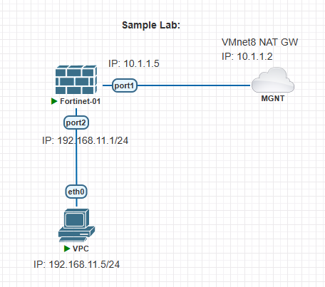
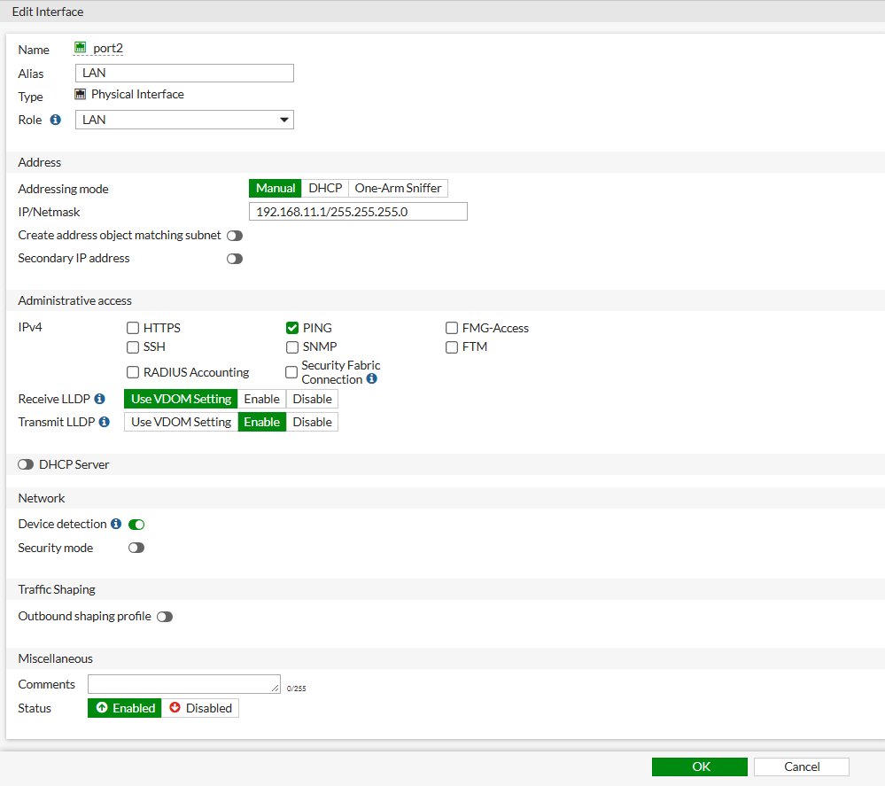

## Sample Lab: 


### Add Devices:

Here is an example with configuration for setting up internet access in **Fortinet firewall**:

- Fortinet firewall: (Fortinet-01)
- Management(Cloud0): (Internet/ISP)


#### Add Devices for Sample Lab: 

1. Right-click - click `Node` - select `fortinet`:
    - Number of nodes to add: `1`
    - Image: `fortinet-v6.2.3`
    - Name: `Fortinet-01`
    - CPU Limit: ✅ 
    - CPU:` 1`
    - RAM (MB): `1024`
    - Ethernet: `4` 
    - Qemu Arch: `x86_64`
    - Qemu NIC: `virtio-net-pci`
    - Qemu Version: `2.4.0 (Default)`
    - Click `Save`


2. Right-click - click `Network` : 
    - Number of networks to add: `1`
    - Name/Prefix: `MGNT`
    - Type: `Management(Cloud0)`
    - Click `Save`





---
---


### Basic Configure Fortinet Firewall:

1. Login to Fortinet (CLI): 

```
FortiGate-VM64-KVM login: admin
Password: Hit Enter (No Password Here)
You are forced to change your password, please input a new password.

New Password: admin123
Confirm Password:admin123
Welcome !
```


2. Set Static IP: 

```
config system interface


FortiGate-VM64-KVM (interface) # ?
edit      Add/edit a table value.
delete    Delete a table value.
purge     Clear all table values.
get       Get dynamic and system information.
show      Show configuration.
end       End and save last config.


FortiGate-VM64-KVM (interface) # edit port1


FortiGate-VM64-KVM (port1) # ? 
config      Configure object.
set         Modify value.
unset       Set to default value.
select      Select multi-option values.
unselect    Unselect multi-option values.
append      Append values to multi-option.
clear       Clear multi-option values.
get         Get dynamic and system information.
show        Show configuration.
next        Configure next table entry.
abort       End and discard last config.
end         End and save last config.


FortiGate-VM64-KVM (port1) # set ?
*vdom                                          Interface is in this virtual domain (VDOM).
vrf                                           Virtual Routing Forwarding ID.
fortilink                                     Enable FortiLink to dedicate this interface to manage other Fortinet devices.
mode                                          Addressing mode (static, DHCP, PPPoE).
distance                                      Distance for routes learned through PPPoE or DHCP, lower distance indicates preferred route.
priority                                      Priority of learned routes.
dhcp-relay-service                            Enable/disable allowing this interface to act as a DHCP relay.
ip                                            Interface IPv4 address and subnet mask, syntax: X.X.X.X/24.
allowaccess                                   Permitted types of management access to this interface.
fail-detect                                   Enable/disable fail detection features for this interface.
dhcp-client-identifier                        DHCP client identifier.
dhcp-renew-time                               DHCP renew time in seconds (300-604800), 0 means use the renew time provided by the server.


FortiGate-VM64-KVM (port1) # set mode ?
static    Static setting.
dhcp      External DHCP client mode.
pppoe     External PPPoE mode.


FortiGate-VM64-KVM (port1) # set mode static


FortiGate-VM64-KVM (port1) # ? 
config      Configure object.
set         Modify value.
unset       Set to default value.
select      Select multi-option values.
unselect    Unselect multi-option values.
append      Append values to multi-option.
clear       Clear multi-option values.
get         Get dynamic and system information.
show        Show configuration.
next        Configure next table entry.
abort       End and discard last config.
end         End and save last config.


FortiGate-VM64-KVM (port1) # set ip ?
<class_ip&net_netmask>    IP address and subnet mask (syntax = 1.1.1.1/24).


FortiGate-VM64-KVM (port1) # set ip 10.1.1.5/24


FortiGate-VM64-KVM (port1) # set allowaccess ping ssh http https


FortiGate-VM64-KVM (port1) # show
config system interface
    edit "port1"
        set vdom "root"
        set ip 10.1.1.5 255.255.255.0
        set allowaccess ping https ssh http
        set type physical
        set snmp-index 1
    next
end


FortiGate-VM64-KVM (port1) # show full-configuration
config system interface
    edit "port1"
        set vdom "root"
        set vrf 0
        set fortilink disable
        set mode static
        set dhcp-relay-service disable
        set ip 10.1.1.5 255.255.255.0
        set allowaccess ping https ssh http
        set fail-detect disable


FortiGate-VM64-KVM (port1) # next

FortiGate-VM64-KVM (interface) # end

```


```
show system interface port1


config system interface
    edit "port1"
        set vdom "root"
        set ip 10.1.1.5 255.255.255.0
        set allowaccess ping https ssh http
        set type physical
        set snmp-index 1
    next
end
```


3. Login to Fortinet (GUI): 

```
http://10.1.1.5/
```


---
---


### Configure default gateway:

If `port1` is your **WAN/uplink** interface:

```
config router static
    edit 1
        set gateway 10.1.1.2
        set device port1
    next
end
```


```
get router info routing-table all


Routing table for VRF=0
Codes: K - kernel, C - connected, S - static, R - RIP, B - BGP
       O - OSPF, IA - OSPF inter area
       N1 - OSPF NSSA external type 1, N2 - OSPF NSSA external type 2
       E1 - OSPF external type 1, E2 - OSPF external type 2
       i - IS-IS, L1 - IS-IS level-1, L2 - IS-IS level-2, ia - IS-IS inter area
       * - candidate default

C       10.1.1.0/24 is directly connected, port1

```


```
execute ping 8.8.8.8
```


---
---


### Setup IP (GUI):

1. Log in to the FortiGate Web GUI.
2. Navigate to: `Network` - `Interfaces` - select `port2`:
    - Edit interface: 
        - Name: `port2`
        - Alias: `LAN`
        - Type: Physical Interface
        - Role: `LAN`
    - Address:
        - Addressing mode: `Manual`
        - IP/Netmask: `192.168.11.1/255.255.255.0`
    - Administrative access:
        - ✅ `PING`
    - DHCP Server:
    - Network:
    - Traffic Shaping: 
    - Miscellaneous
        - Comments
        - `Enabled`
    - Click `OK`





---
---


### VPC Configuration:

```
show ip

ip 192.168.11.5/24 192.168.11.1

save
```


---
---


