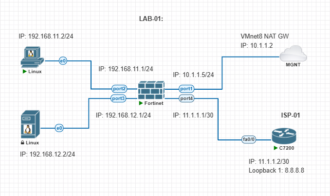

## Basic LAB: 


### Lab Topology: 




---
---


## IP Configure on Fortinet Firewall: 


### Set Static IP (CLI): 


_Set Static IP:_
```conf
## Set IP on port1 (MGNT): 
config system interface
  edit port1
    set mode static
    set ip 10.1.1.5/24
    set allowaccess ping ssh https http
  next
end
```


_Show interface configuration:_
```
show system interface port1
```


### IP Configure on `port2`:


1. Navigate to: `Network` - `Interfaces` - select `port2`:
    - Edit interface: 
        - Name: `port2`
        - Alias: `LAN`
        - Type: Physical Interface
        - Role: `LAN`
    - Address:
        - Addressing mode: `Manual`
        - IP/Netmask: `192.168.11.1/255.255.255.0`
    - Administrative access:
        - ✅ `PING`
    - DHCP Server:
    - Network:
    - Traffic Shaping: 
    - Miscellaneous
        - Comments
        - `Enabled`
    - Click `OK`


### IP Configure on `port3`:

1. Navigate to: `Network` - `Interfaces` - select `port3`:
    - Edit interface: 
        - Name: `port3`
        - Alias: `LAN`
        - Type: Physical Interface
        - Role: `LAN`
    - Address:
        - Addressing mode: `Manual`
        - IP/Netmask: `192.168.12.1/255.255.255.0`
    - Administrative access:
        - ✅ `PING`
    - DHCP Server:
    - Network:
    - Traffic Shaping: 
    - Miscellaneous
        - Comments
        - `Enabled`
    - Click `OK`


### IP Configure on `port4`:

1. Navigate to: `Network` - `Interfaces` - select `port4`:
    - Edit interface: 
        - Name: `port4`
        - Alias: `WAN`
        - Type: Physical Interface
        - Role: `WAN`
    - Address:
        - Addressing mode: `Manual`
        - IP/Netmask: `11.1.1.1/255.255.255.0`
    - Administrative access:
        - ✅ `PING`
    - DHCP Server:
    - Network:
    - Traffic Shaping: 
    - Miscellaneous
        - Comments
        - `Enabled`
    - Click `OK`


### Configure default gateway to ISP (GUI): 

1. Navigate to: `Network` - `Static Routes` - click `+ Create New`:
    - Destination (**Subnet**):  `0.0.0.0/0.0.0.0`
    - Gateway Address: `11.1.1.2`
    - Interface: `port4`
    - Administrative Distance: 10 
    - Comments: 
    - Status: `Enabled`
    - Click `OK`


_Or CLI: Configure default gateway to ISP:_
```conf
## If port1 is your WAN/uplink interface:
config router static
    edit 1
        set device port4
        set dst 0.0.0.0/0
        set gateway 11.1.1.2
    next
end
```


_Show route table:_
```
get router info routing-table all
```


---
---


## Router Configure (ISP-01): 


_Router Configure:_
```conf
int f0/0
ip address 11.1.1.2 255.255.255.252
no shutdown
exit

int loopback 1
ip address 8.8.8.8 255.255.255.255
no shutdown
exit


ip route 192.168.11.0 255.255.255.0 11.1.1.1
ip route 192.168.12.0 255.255.255.0 11.1.1.1
ip route 192.168.13.0 255.255.255.0 11.1.1.1

ip http server
ip http secure-server

ip http port 80
ip http secure-port 443


username admin secret secret123
line vty 0 5
login local
end

exit
```


---
---


## Create Firewall Policy:


### Allow to Internet: 


This is the main firewall policy that allows Linux PC IP `192.168.11.2` to reach the router `C7200` loopback address `8.8.8.8`.


1. Navigate to: `Policy & Objects` - `IPv4 Policy` - click `+ Create New`:
    - Name: `inside-LAN-port2-to-WAN`
    - Incoming Interface: `port2`
    - Outgoing Interface: `WAN (port4)`
    - Source: `all` (<-- Specific IP or Network)
    - Destination: `all` (<-- Specific IP or Network)
    - Schedule: `always`
    - Service: `ALL` (<-- Specific service: `http`, `https` and etc)
    - Action: `ACCEPT`
    - Inspection Mode: `Flow-based` 
    - Firewall / Network Options: 
        - NAT: ❌ 
        - IP Pool Configuration: `Use Outgoing Interface address`
        - Preserve Source Port: ❌
        - Protocol Options: `default`
    - Security Profiles:
        - AntiVirus: ❌
        - Web Filter: ❌
        - DNS Filter: ❌
        - Application Control: ❌
        - IPS: ✅ `default`
        - SSL Inspection: `certificate-inspection`
    - Logging Options:
        - Log Allowed Traffic: ✅ `Security Events` 
        - Generate Logs when Session Starts: ❌
        - Capture Packets: ❌
    - Comments: 
    - Enable this policy: ✅ 
    - Click `OK`


---
---


## Log Setting:


1. Navigate to: `Log & Report` - `Log Settings`: 
    - Local Log:
        - Memory: ✅
    - Remote Logging and Archiving: 
        - Send logs to FortiAnalyzer/FortiManager: ❌
        - Send logs to syslog: ❌
    - ❌ Cloud Logging
    - UUIDs in Traffic Log:
        - Policy: ✅
        - Address: ❌
    - Log Settings: 
        - Event Logging: `All`
    - Local Traffic Log: `All`
    - GUI Preferences:
        - Resolve Hostnames: ✅
        - Resolve Unknown Applications: ✅
    - Click `Apply`

2. Navigate to: `Log & Report` - `Forward Traffic`.  


---
---


