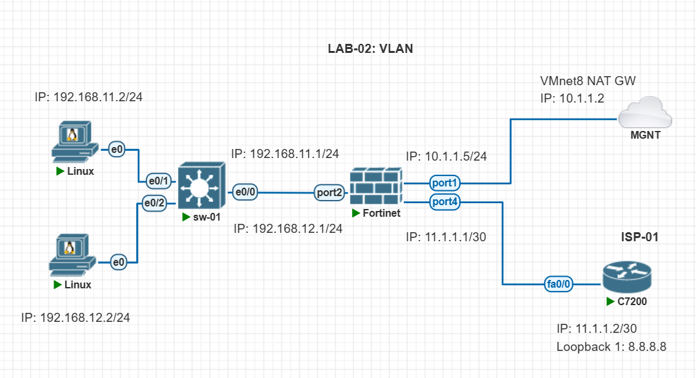

## VLAN LAB: 


### Lab Topology: 




---
---


## Configure VLAN on Switch:

_Switch Configure:_
```conf 
vlan 11
name IT
exit

vlan 12
name MKT
exit

int e0/1
switchport mode access
switchport access vlan 11
exit

int e0/2
switchport mode access
switchport access vlan 12
exit

int e0/0
switchport trunk encapsulation dot1q
switchport mode trunk
switchport trunk allowed vlan 11,12
switchport trunk allowed vlan add 20
exit

```


```
sh vlan brief

sh int trunk
```


---
---


## Configure VLAN on Firewall: 


### Create VLAN on `port2`:

1. Navigate to: `Network` - `Interfaces` - select `port2`:
    - Edit interface: 
        - Name: `port2`
        - Alias: `LAN`
        - Type: `Physical Interface`
        - Role: `Undefined`
    - Address:
        - Addressing mode: `Manual`
        - IP/Netmask: `0.0.0.0/0.0.0.0`  (<-- No IP address)
    - Administrative access:
    - DHCP Server:
    - Network:
    - Traffic Shaping: 
    - Miscellaneous
        - Comments
        - `Enabled`
    - Click `OK`


2. Navigate to: `Network` - `Interfaces` - click `+ Create New` - click `Interface`:
    - Edit interface: 
        - Name: `VLAN-IT-11`
        - Alias: `LAN`
        - Type: `VLAN`
        - Interface: `LAN (port2)`
        - VLAN ID: `11` 
        - Role: `LAN`
    - Address:
        - Addressing mode: `Manual`
        - IP/Netmask: `192.168.11.1/255.255.255.0`
        - Create address object matching subnet: ✅
    - Administrative access:
        - ✅ `PING`
    - DHCP Server:
    - Network:
    - Traffic Shaping: 
    - Miscellaneous
        - Comments
        - `Enabled`
    - Click `OK`


3. Navigate to: `Network` - `Interfaces` - click `+ Create New` - click `Interface`:
    - Edit interface: 
        - Name: `VLAN-MKT-12`
        - Alias: `LAN`
        - Type: `VLAN`
        - Interface: `LAN (port2)`
        - VLAN ID: `12` 
        - Role: `LAN`
    - Address:
        - Addressing mode: `Manual`
        - IP/Netmask: `192.168.12.1/255.255.255.0`
        - Create address object matching subnet: ✅
    - Administrative access:
        - ✅ `PING`
    - DHCP Server:
    - Network:
    - Traffic Shaping: 
    - Miscellaneous
        - Comments
        - `Enabled`
    - Click `OK`


---
---


## Create Firewall Policy:


### VLAN to VLAN Communication: 

This is the firewall policy that allows VLAN `192.168.11.0/24` to reach the VLAN `192.168.12.0/24` and vice-versa. 


1. Navigate to: `System` - `Feature Visibility`:
    - ✅ `Multiple Interface Policies`  (<-- Enable it)
    - Click `Apply`


2. Navigate to: `Policy & Objects` - `IPv4 Policy/Firewall Policy` - click `+ Create New`:
    - Name: `VLAN-IT-11-to-VLAN-IT-12-allow`
    - Incoming Interface: `VLAN-IT-11` and `VLAN-MKT-12`
    - Outgoing Interface: `VLAN-IT-11` and `VLAN-MKT-12` (<-- also allow to internet for add `WAN (port4)`)
    - Source: `all` (<-- Specific IP or Network)
    - Destination: `all` (<-- Specific IP or Network)
    - Schedule: `always`
    - Service: `ALL` (<-- Specific service: `http`, `https` and etc)
    - Action: `ACCEPT`
    - Inspection Mode: `Flow-based` 
    - Firewall / Network Options: 
        - NAT: ❌ 
        - IP Pool Configuration: `Use Outgoing Interface address`
        - Preserve Source Port: ❌
        - Protocol Options: `default`
    - Security Profiles:
        - AntiVirus: ❌
        - Web Filter: ❌
        - DNS Filter: ❌
        - Application Control: ❌
        - IPS: ✅ `default`
        - SSL Inspection: `certificate-inspection`
    - Logging Options:
        - Log Allowed Traffic: ✅ `Security Events` 
        - Generate Logs when Session Starts: ❌
        - Capture Packets: ❌
    - Comments: 
    - Enable this policy: ✅ 
    - Click `OK`


### Or, VLAN to VLAN Communication without Policy: 

1. Navigate to: `Network` - `Interfaces` - click `+ Create New` - click `Zone`:
    - Name: `VLAN-IT-MKT-Zone`
    - Block intra-zone traffic: ✅  (<-- Disable for intra-zone traffic not allow)
    - Interface members: `VLAN-IT-11` and `VLAN-MKT-12`
    - Click `OK`


2. Navigate to: `Policy & Objects` - `IPv4 Policy/Firewall Policy` - click `+ Create New`:
    - Name: `VLAN-IT-MKT-Zone-allow-to-WAN`
    - Incoming Interface: `VLAN-IT-MKT-Zone`
    - Outgoing Interface: `WAN (port4)` 
    - Source: `all` (<-- Specific IP or Network)
    - Destination: `all` (<-- Specific IP or Network)
    - Schedule: `always`
    - Service: `ALL` (<-- Specific service: `http`, `https` and etc)
    - Action: `ACCEPT`
    - Inspection Mode: `Flow-based` 
    - Firewall / Network Options: 
        - NAT: ❌ 
        - Protocol Options: `default`
    - Enable this policy: ✅ 
    - Click `OK`


---
---


